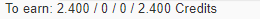
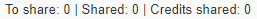

# Beta
<h3><a href="https://jrh-1997.github.io/Scripts-MKS/Beta-NL">Nederlands </a> /<a href="https://jrh-1997.github.io/Scripts-MKS/Beta-EN"> English</a></h3>

Dear Beta testers,
  
Thanks for testing this script! The newest Beta features will be updated on this site. 
  
<b>NOTE: To use these scripts, tampermonkey is required in your browser. <a href="https://www.tampermonkey.net/">Click here to install Tampermonkey</a> </b>
  
Incase of questions, comments or requests you can contact me through <a href="https://www.meldkamerspel.com/messages/new?target=Jrh1997">a message in the dutch MKS</a>, <a href="https://forum.meldkamerspel.com/wcf/index.php?ConversationAdd/&userID=933">a direct message on the dutch forums</a>, <a href="https://forum.meldkamerspel.com/index.php?thread/2930-scripts-mks-jrh1997/"> in the topic on the dutch forums</a>, <a href="https://github.com/JRH-1997/Scripts-MKS/issues"> here on Github Issues</a> or by a private message on Discord JRH1997#2625. 
  
I hope these scripts will bring a little more joy to your gaming experience.
  
Greetings Jrh1997
  

<b>The installation link is not available on the site</b>
  
<B>Last updated: Readme: 01-10-2020</b>

<B>LICENSING:</b> 
These scripts are owned by their respective owners. None of the scripts are permitted to be modifified or distributed without my explicit permission.  
Any scripts belonging to different owners and not allowed to be modified or redistributed without the owners respective permission.
I've personally obtained permission to redistribute these scripts. If you like to do so as well. I will refer you to the respective people.

# Scripts-MKS
Below I will give a brief description of each component of the script. 
Next to the personal menu a new menu will appear where you will find all the functions this script has to offer.

# Double Credits Event:
<b>(Instelling: Credits > Automatisch dubbele credits event)</b>
 
This function calculates the double credits when the double credits event is active. 
It working with te following modules:
- RemainingCredits
- Credits Missionheader
- Credits Missionlist
  
The function is on by default. It can be turned off in the menu. 

# RemainingCredits: 
<b>(Settings: Credits > Totals above missionlist)</b>
 
<b>(Original by LennardFTD. Permission to redistribute.)</b>
 
This option shows the average earnings for your missions added up in three different categories.
 

 
The image above shows how this is being displayed. The amounts shown are the following categories from left to right:
-   Personal missions, including scheduled transport missions.
-	Planned missions (Not displayed in the UK version)
-   Alliance Missions, including alliance event missions.
-	Total, previous three added together (Optional, Not shown in image yet).
 
An "Ambulance Only" mission is added to the amounts for 250 credits each. This is because that is the amount for a ambulance only mission without transporting the patient. More patients, fly car or transporting a patients has higher earnings.
 

# Totals of Shared / To share missions:
<b>(Settings: Alliance > Totals of to share / Shared missions)</b> 
<b>(Original by Jan/KBOE2. Permission to redistribute.)</b>
 
This function shows number of the to share, number of the shared and the credits total of the shared missions.  
The credits value from when it is count as a to share mission is the same as the value of the label. You can change this in the menu.  

# Credits Missionlist: 
<b>(Settings: Credits > In missionlist, as text or label)</b> 
<b>(Original by ItsDreyter. Permission obtained for redistribution )</b>
 
This options added the average earnings for each mission in the missionlist.
It comes in two variations: Colored label or plain text, including the variation for behind the mission name. This variation works exceptionally well with a missionList cosmetics script by MisteryKid. ( Not yet publically available ).

### Variation Label:
In the image below you can see an example of a mission with the colored label:

 
The labels come in four different colors, representing the average earned amount per mission. The default settings:
- Ambulance Only missions: 
- Missions up to 4499 credits: 
- Missions from 4500 up to 7999 credits: 
- Missions from 8000 credits or higher: 
 
The green and red labels are customizable from when they are displayed.
 

### Variantion Text:
Below an example of a mission with text average credit earnings and an example for Ambulance Only missions.
 

 

# Credits Missionheader
<b>(Settings: Credits > In missionheader, as text or label)</b>
 
This options added the average earnings for the mission in the missionheader.
  

 
In the image above you can see an example.
 
The labels come in four different colors, representing the average earned amount per mission. The default settings:
- Ambulance Only missions: 
- Missions up to 4499 credits: 
- Missions from 4500 up to 7999 credits: 
- Missions from 8000 credits or higher: 
 
The green and red labels are customizable from when they are displayed.
 

# Label Alliance
<b>(Settings: Alliance Label)</b>
 
This feature shows a label if the mission is large enough to share with your team. There are two versions: one for the mission header and one for the mission list.
  
This is what the label looks like: 
  
This starting number of credits which displays this label can be set in the script menu. Default is set at 3000 credits. If you want to change this, this can be done in the menu.
 
Optional:  The label can be in the same colors as the Credits labels. 
 

# Hide AlarmNextShare Button
<b>(Setting: Hide "Alert, share and next" button)</b>
 
This function hides the "Alert, share and next" button, optionally set to remove only the top one.
  
Below you see two images. The first is as it is now and the second is if you are using the script. This is to show the difference.
 

 

 

# Hotkey
<b>(Setting: Shortcut Keys)</b>
 
This feature provides keyboard shortcuts supplementing the default keyboard shortcuts already in the game:
- Saving a new POI
- Opening a radio call
  
It seems to me that saving a new POI speaks for itself, if more explanation is needed, then I would like to hear it.  
I will explain something more about opening radio calls:
- When the detainee or patient has to be transported, this function opens the radio call. 
- When the top radio call is an extended notification, this function opens the extended notification and immediately removes it from your status list. 
  

# HideMap
<b>(Setting: Hide on map)</b> 
 
This feature can hide different parts of the map.
  
The following parts can be hidden:
- Missions: 
    - Personal Missions:
		- By state (Red/Yellow/Green)
		- Involved missions (If you have sent a vehicle to the missions)
		- Shared or not shared
    - Alliance Missions:
		- By state (Red/Yellow/Green)
		- Involved missions (If you have sent a vehicle to the missions)
    - Event Missions:
		- By state (Red/Yellow/Green)
		- Involved missions (If you have sent a vehicle to the missions)
- Vehicles: (Only available on OpenSourceMap, not on MapKit.)
    - All own vehicles
    - Alliance vehicles
    - Own available non-stationary vehicles
- POI by name
 

# Hide Missionlist
<b>(Settings: Hide from missionlist)</b>
 
This options hides missions from the mission list based on one or more of these options:
- Personal Missions:
    - All personal missions
    - Involved own missions ( own missions you have a vehicle enroute/on scene )
	- Not involved own missions 
    - Shared missions
    - Non-Shared Missions
	- Missions under the alliance value 
- Alliance Missions:
    - All alliance missions
    - Involved alliance missions (alliance missions you have a vehicle enroute/on scene)
    - Involved event missions (event missions you have a vehicle enroute/on scene)
 

# Toplist Rank
<b>(Settings: Toplist rank in header)</b>
 
This function shows your place in the rankings at the top of the menu bar. If you click on it, the correct page of the rankings will also open immediately.
 

