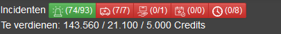
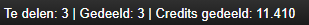
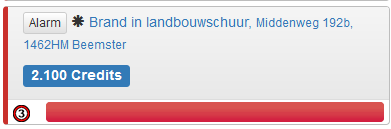
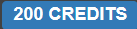
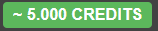
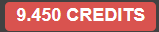
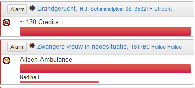
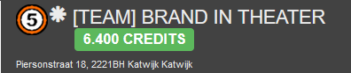
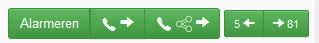
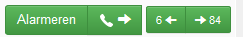

# Beta
<h3><a href="https://jrh-1997.github.io/Scripts-MKS/Beta-NL">Nederlands </a> /<a href="https://jrh-1997.github.io/Scripts-MKS/Beta-EN"> English</a></h3>

Beste Beta-tester, 
  
Bedankt dat je dit script test. In de onderstaande beschrijving zijn de functies in de laatste Beta-update steeds opgenomen. 
  
<b>LET OP! Om het script te kunnen installeren is Tampermonkey nodig in je browser: <a href="https://www.tampermonkey.net/">Installeer Tamponkey</a> </b>
  
Indien er vragen, opmerkingen en/of verzoeken zijn kunnen jullie mij bereiken via <a href="https://www.meldkamerspel.com/messages/new?target=Jrh1997">een bericht in het spel</a>, <a href="https://forum.meldkamerspel.com/wcf/index.php?ConversationAdd/&userID=933">een bericht op het forum</a>, <a href="https://forum.meldkamerspel.com/index.php?thread/2930-scripts-mks-jrh1997/"> in het topic op het forum</a>, <a href="https://github.com/JRH-1997/Scripts-MKS/issues"> hier bij issues</a> of via Discord JRH1997#2625. 
  
Hopelijk hebben jullie er plezier van.
  
Groet Jrh1997
  
<b>De installatielink voor Beta is niet via deze site beschikbaar.</b>
  
<B>Laatste update Readme: 29-08-2020</b>

<B>Auteursrecht:</b> 
Op alle scripts rust het Nederlandse Auteursrecht. Scripts mogen niet zonder toestemming worden bewerkt of verder verspreidt.  
Bij onderdelen waar het originele auteursrecht bij een derde rust, mogen deze niet zonder toestemming van deze derde worden bewerkt of verspreidt.
Voor deze onderdelen is toestemming van de derden verkregen om deze te bewerken en te delen in mijn scripts. Ik zal u voor de betreffende specifieke delen dan ook doorverwijzen. 

# Scripts-MKS
Hieronder zal ik een korte uitleg geven over de verschillende onderdelen in het script. 
Er zal bovenin de menubalk een extra knop komen waar alle functies in zijn opgenomen. 

# Double Credits Event:
<b>(Instelling: Credits > Automatisch dubbele credits event)</b>
 
Deze functie berekent automatisch de dubbele credits bij de volgende modules als ze actief zijn en het dubbele credits event actief is:
- RemainingCredits
- Credits Missionheader
- Credits Missionlist
  
Deze functie staat standaard aan. De functie is uit te zetten in het menu. 
# RemainingCredits: 
<b>(Instelling: Credits > Totalen boven meldingenlijst)</b>
 
<b>(Met dank aan LennardTFD voor het originele Duitse basisscript. Ik heb toestemming om het te delen. )</b>
 
Deze functie laat zien wat je meldingen in je meldingenlijst gemiddeld bij elkaar opleveren verdeeld in 3 categorieën. 
 

 
Op de afbeelding hierboven kan je zien hoe dit wordt weergegeven. De getallen staan voor de volgende categorieën van links naar rechts:
-	Eigen meldingen, inclusief besteld vervoer. 
-	Geplande inzetten (alleen in UK wordt deze niet weergegeven). 
-	Teammeldingen, inclusief teamevent.
-	Eindtotaal (optioneel, staat nog niet op de afbeelding)
 
Een alleen ambulance melding wordt voor 250 credits meegenomen, omdat dit het aantal credits is dat een patiënt zonder vervoer oplevert. Met meer patiënten, wel vervoer of MMT is de opbrengst dus hoger. 
 

# Totalen van gedeelde / te delen meldingen:
<b>(Instelling: Team > Totalen van de te delen / gedeelde meldingen)</b> 
<b>(Met dank aan Jan/KBOE2 voor het originele basisscript. Ik heb toestemming om het te delen.)</b>
 
Deze functie geeft totalen van het aantal te delen, aantal gedeelde en totaal credits van de gedeelde meldingen.  Het aantal te delen wordt bepaald aan de hand van het ingestelde aantal credits in het scriptmenu onder Team. 

# Credits Missionlist: 
<b>(Instelling: Credits > In meldingslijst als label/text (achter de naam))</b> 
<b>(Met dank aan ItsDreyter voor het originele Duitse basisscript. Ik heb toestemming om het te delen. )</b>
 
Deze functie geeft het gemiddeld aantal te verdienen credits weer bij de melding in de meldingenlijst. 
Deze functie heb ik in 2 varianten: als gekleurd label of als tekst, daarnaast nog de variant achter de naam. Die werkt goed in combinatie met het script van MisteryKid waar de volledige meldingenlijst  een andere opmaak krijgt. (Nog niet publiekelijk beschikbaar)

### Variant Label:
Hieronder zie je een voorbeeld van een melding waar een gekleurd label in staat:

 
De Labels zijn er in 4 kleuren, die de grootte van de melding aangeven. De standaard instelling is:
- Voor meldingen met alleen ambulances: 
- Voor meldingen t/m 4499 credits: 
- Voor meldingen vanaf 4500 t/m 7999 credits: 
- Voor meldingen van 8000 credits en hoger: 
 
De groene en rode labels zijn naar wens aan te passen vanaf wanneer deze getoond worden.
 
### Variant Tekst:
Hieronder zie je een voorbeeld van een melding waar credits als tekst staan en een voorbeeld van een melding waar alleen een ambulance nodig is. 
 

 

# Credits Missionheader
<b>(Instelling: Credits > In meldingstitel als label/text)</b>
 
Deze functie geeft in de bovenste balk van de melding het gemiddeld aantal credits van die melding weer in een gekleurd label.
  

 
Hierboven zie je een voorbeeld hoe dit er uit ziet. 
 
De Labels zijn er in 4 kleuren, die de grootte van de melding aangeven. De standaard instelling is:
- Voor meldingen met alleen ambulances: 
- Voor meldingen t/m 4499 credits: 
- Voor meldingen vanaf 4500 t/m 7999 credits: 
- Voor meldingen van 8000 credits en hoger: 
 
De groene en rode labels zijn naar wens aan te passen vanaf wanneer deze getoond worden.
 

# Label Alliance
<b>(Instelling: Team Label)</b>
 
Deze functie toont een label als de melding groot genoeg is om met je team te mogen delen. Er zijn 2 versies: 1 voor in de missionheader en 1 voor de missionlist. 
  
Zo ziet het label er uit: 
  
Het aantal credtis vanaf wanneer dit label getoond wordt is eenvouding aan te passen in het script. Het is standaard vanaf 3000 en als je het anders wilt is het alleen maar het getal wijzigen in het menu en op opslaan drukken.  
 
Optioneel: Het label kan dezelfde kleur krijgen als de credits labels. 
 

# Hide AlarmNextShare Button
<b>(Instelling: Verberg "Alarmeer, deel en volgende" knop)</b>
 
Deze functie verbergt de "Alarmeer, deel en volgende" knop, optioneel is in te stellen om alleen de bovenste te verwijderen. 
  
Hieronder zie je 2 afbeeldingen. De eerste is zoals het nu is en de tweede is als je het script gebruikt. Dit om het verschil te laten zien. 
 

 

 

# Hotkey
<b>(Instelling: Sneltoetsen)</b>
 
Deze functie geeft sneltoetsen voor het indrukken van knoppen in het spel:
- Opslaan van een nieuwe POI
- Openen van een spraakaanvraag
  
Het lijkt mij dat opslaan van een nieuwe POI voor zichzelf spreekt, is er meer uitleg nodig, dan hoor ik het graag.  
Het openen van spraakaanvragen zal ik nog iets uitleggen:
- Op het moment dat de arrestant of patiënt vervoerd moet worden, dan opent deze functie de spraakaanvraag. 
- Op het moment dat de bovenste spraakaanvraag een uitgebreide melding is, dan opent deze functie de uitgebreide melding en haalt deze gelijk uit je statuslijst. 
  

# HideMap
<b>(Instelling: Verberg op kaart)</b> 
 
Deze functie kan verschillende onderdelen op de kaart te verbergen. 
Let op: Alleen te gebruiken op de OpenStreetMap Kaart. Alle fucnties zijn gedeactiveerd in de MapKit kaart. 
  
De volgende onderdelen kunnen verborgen worden:
- Meldingen: 
    - Eigen meldingen: 
		- Op basis van status (rood, geel, groen)
		- Betrokken meldingen (Als je er een voertuig heen hebt)
		- Gedeeld/Niet gedeeld
    - Team meldingen:
		- Op basis van status (rood, geel, groen)
		- Betrokken meldingen (Als je er een voertuig heen hebt)
    - Event meldingen:
		- Op basis van status (rood, geel, groen)
		- Betrokken meldingen (Als je er een voertuig heen hebt)
- Voertuigen: 
    - Alle eigen voertuigen
    - Team voertuigen
    - Vrije eigen voertuigen (status 4 of 6)
- POI op basis van naam
 

# Hide Missionlist
<b>(Instelling: Verberg in meldingenlijst)</b>
 
Deze functie verbergt meldingen in de meldingenlijst op basis van verschillende opties:
- Eigen meldingen:
    - Alle eigen meldingen
    - Betrokken eigen meldingen (waar je een voertuig heen hebt gestuurd)
    - Gedeelde meldingen
    - Niet gedeelde meldingen
- Team meldingen:
    - Alle team meldingen
    - Betrokken team meldingen (waar je een voertuig heen hebt gestuurd)
    - Betrokken event meldingen (waar je een voertuig heen hebt gestuurd)
 

# Toplist Rank
<b>(Instelling: Toplist plaats in menubalk)</b>
 
Deze functie laat bovenin de menubalk je plaats in de ranglijst zien. Als je er op klikt opent de goede pagina van de ranglijst ook direct.
 

