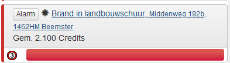
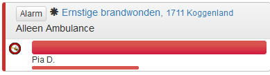

# RemainingCredits: 
<b>(Met dank aan LennardTFD voor het originele Duitse script. Ik heb toestemming om het te delen. )</b>
 
Dit script laat zien wat je meldingen in je meldingenlijst totaal gemiddeld opleveren verdeeld in 3 categorieën. 
 

 
Op de afbeelding hierboven kan je zien hoe dit wordt weergegeven. De getallen staan voor de volgende categorieën van links naar rechts:
-	Eigen meldingen, inclusief besteld vervoer. 
-	Geplande inzetten (alleen in UK wordt deze niet weergegeven. 
-	Teammeldingen, inclusief teamevent
 
Een alleen ambulance melding wordt voor 250 credits meegenomen, omdat dit het aantal credits is dat een patiënt zonder vervoer oplevert. Met meer patiënten, wel vervoer of MMT is de opbrengst dus hoger. 
 
( Dit script werkt momenteel voor de volgende versies: NL, DE, UK, US en AU, wordt nog uitgebreid)
 
<b><a href="https://github.com/JRH-1997/MKS-scripts/raw/master/RemainingCredits.user.js">Installeer RemainingCredits</a></b>

# Credits Missionlist:
Dit script geeft het gemiddeld aantal te verdienen credits weer bij de melding in de meldingenlijst. 
Dit script heb ik in 2 varianten. Als gekleurd label of als tekst. 

## Variant Label:
Hieronder zie je een voorbeeld van een melding waar een gekleurd label in staat:

 
De Labels zijn er in 4 kleuren, die de grootte van de melding aangeven:
- Voor meldingen met alleen ambulances: 
- Voor meldingen t/m 4499 credits: 
- Voor meldingen vanaf 4500 t/m 7999 credits: 
- Voor meldingen van 8000 credits en hoger: 

## Variant Tekst:
Hieronder zie je een voorbeeld van een melding waar credits als tekst staan en een voorbeeld van een melding waar alleen een ambulance nodig is. 
 

 

 
 
(Dit script werkt momenteel alleen in de NL versie, wordt nog aan gewerkt)

<b><a href="https://github.com/JRH-1997/MKS-scripts/raw/master/Credits_Missionlist_Text.user.js">Installeer Credits Missionlist Text</a></b>
 
<b><a href="https://github.com/JRH-1997/MKS-scripts/raw/master/Credits_Missionlist_label.user.js">Installeer Credits Missionlist Label</a></b>
 

# Credits Missionheader
Dit script geeft in de bovenste balk van de melding het gemiddeld aantal credits van die melding weer in een gekleurd label.
  

 
Hierboven zie je een voorbeeld hoe dit er uit ziet. 
 
De Labels zijn er in 4 kleuren, die de grootte van de melding aangeven:
- Voor meldingen met alleen ambulances: 
- Voor meldingen t/m 4499 credits: 
- Voor meldingen vanaf 4500 t/m 7999 credits: 
- Voor meldingen van 8000 credits en hoger: 
 
<b><a href="https://github.com/JRH-1997/MKS-scripts/raw/master/Credits_Missionheader.user.js">Installeer Credits Missionheader</a></b>

